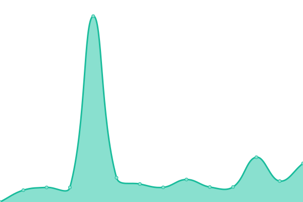
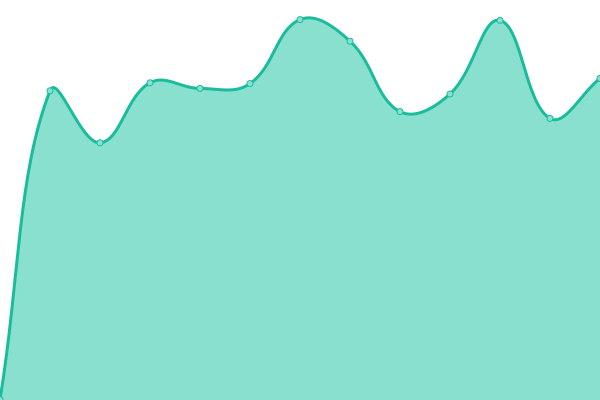
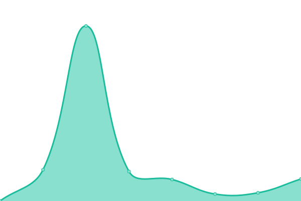

# [📈 Live Status](https://Multigol.github.io/Status): <!--live status--> **🟧 Partial outage**

This repository contains the open-source uptime monitor and status page for [Multigol](https://Multigol.github.io/Status), powered by [Upptime](https://github.com/upptime/upptime).

With [Upptime](https://upptime.js.org), you can get your own unlimited and free uptime monitor and status page, powered entirely by a GitHub repository. We use [Issues](https://github.com/Multigol/Status/issues) as incident reports, [Actions](https://github.com/Multigol/Status/actions) as uptime monitors, and [Pages](https://Multigol.github.io/Status) for the status page.

<!--start: status pages-->
<!-- This summary is generated by Upptime (https://github.com/upptime/upptime) -->
<!-- Do not edit this manually, your changes will be overwritten -->
<!-- prettier-ignore -->
| URL | Status | History | Response Time | Uptime |
| --- | ------ | ------- | ------------- | ------ |
|  [Multigol](https://www.multigol.com.ar) | 🟩 Up | [multigol.yml](https://github.com/Multigol/Status/commits/HEAD/history/multigol.yml) | 

 2159ms
     
 | 

<a href="https://Multigol.github.io/Status/history/multigol">100.00%</a>
    

|  [Multigol Digital](https://www.multigoldigital.com.ar) | 🟥 Down | [multigol-digital.yml](https://github.com/Multigol/Status/commits/HEAD/history/multigol-digital.yml) | 

 3041ms
     
 | 

<a href="https://Multigol.github.io/Status/history/multigol-digital">94.49%</a>
    

|  [RENAPER](https://apirenaper.idear.gov.ar/apidatos/porDniSexo.php) | 🟩 Up | [renaper.yml](https://github.com/Multigol/Status/commits/HEAD/history/renaper.yml) | 

 2139ms
     
 | 

<a href="https://Multigol.github.io/Status/history/renaper">98.90%</a>
    

|  [NOSIS](https://ws02.nosis.com/api/validacion/?) | 🟩 Up | [nosis.yml](https://github.com/Multigol/Status/commits/HEAD/history/nosis.yml) | 

 1336ms
     
 | 

<a href="https://Multigol.github.io/Status/history/nosis">100.00%</a>
    

|  [B2Chat](https://api.b2chat.io/health) | 🟥 Down | [b2-chat.yml](https://github.com/Multigol/Status/commits/HEAD/history/b2-chat.yml) | 

 311ms
     
 | 

<a href="https://Multigol.github.io/Status/history/b2-chat">100.00%</a>
    

|  [WebHook MP](https://multigol.float-zone.com:8888/status) | 🟩 Up | [web-hook-mp.yml](https://github.com/Multigol/Status/commits/HEAD/history/web-hook-mp.yml) | 

 643ms
     
 | 

<a href="https://Multigol.github.io/Status/history/web-hook-mp">44.42%</a>
    

|  [Colpy](https://www.colppy.com/) | 🟩 Up | [colpy.yml](https://github.com/Multigol/Status/commits/HEAD/history/colpy.yml) | 

 456ms
     
 | 

<a href="https://Multigol.github.io/Status/history/colpy">100.00%</a>
    

|  [MacroClickagos](http://203.161.54.76:8001/test) | 🟥 Down | [macro-clickagos.yml](https://github.com/Multigol/Status/commits/HEAD/history/macro-clickagos.yml) | 

 104ms
     
 | 

<a href="https://Multigol.github.io/Status/history/macro-clickagos">96.31%</a>
    

<!--end: status pages-->

[**Visit our status website →**](https://Multigol.github.io/Status)

## 📄 License

- Powered by: [Upptime](https://github.com/upptime/upptime)
- Code: [MIT](./LICENSE) © [Multigol](https://Multigol.github.io/Status)
- Data in the `./history` directory: [Open Database License](https://opendatacommons.org/licenses/odbl/1-0/)
